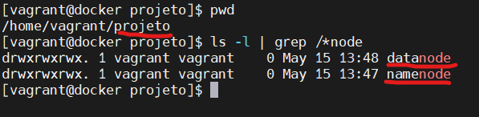
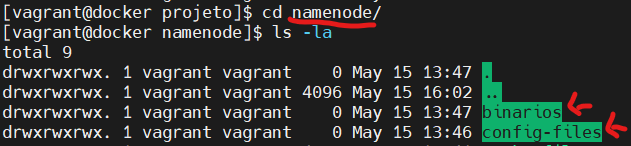
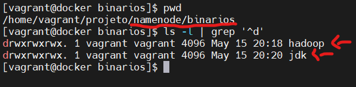
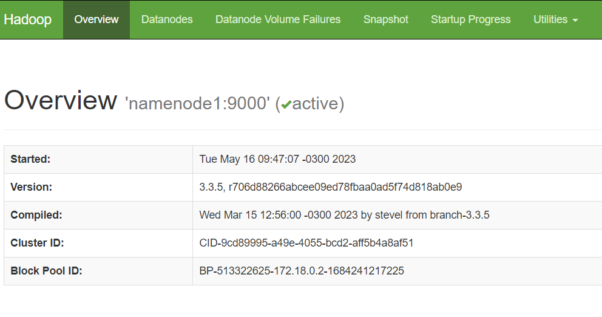
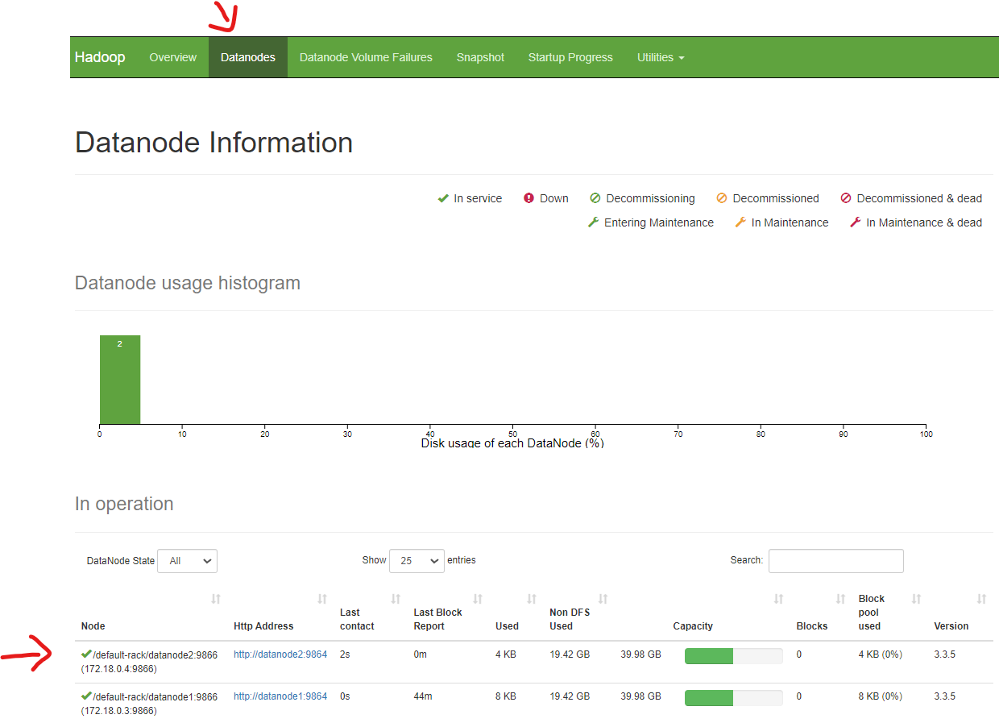


## Vagrant - Provisionando de um cluster Hadoop 3.3.5 usando Docker

Criar de forma rápida e objetiva um cluster Hadoop 3.3.5 com provisionamento no Docker.

Primeiro criaremos as imagens com Hadoop tanto para o namenode e datanode, depois subiremos os containers e ainda será mostrado como enviar as imagens para o DockerHub.

### Requisitos mínimos

Ter em seu SO host o seguinte software.
Abaixo segue o link para download.

- Docker (Software para criação e administração de containers)

  https://docs.docker.com/get-docker/

  Se quiser montar um ambiente com docker completamente isolado do seu SO no tutorial abaixo mostro como fazer isso.

  https://github.com/tiagotsc/vagrant-docker

### Siga as etapas

1 - Crie uma pasta com nome de sua preferência em qualquer lugar do seu SO. No meu caso vou chama lá de “**projeto**”, dentro dela crie as pastas namenode e datanode, conforme figura abaixo:



Cada pasta terá configurações expecificas para que possamos criar as imagens do **namenode** e **datanode**.

2 - Dentro das pastas **namenode** e **datanode**, crie as pastas **binarios** e **config-files**, conforme exemplo da figura abaixo da pasta **namenode**:




3 - Faça o download do **Apache Hadoop 3.3.5** e do **Java JDK 1.8** e descompacte em qualquer lugar.

Segue link dos binários, lembrando que os links podem mudar com o tempo:

- Hadoop 3.3.5

  https://dlcdn.apache.org/hadoop/common/hadoop-3.3.5/hadoop-3.3.5.tar.gz

- Java JDK 1.8 (Exemplo: Linux x64 jdk-8u202-linux-x64.tar.gz)

  https://www.oracle.com/br/java/technologies/javase/javase8-archive-downloads.html

```bash
# Descompacta os arquivos
tar -xvf hadoop-3.3.5.tar.gz
tar -xvf jdk-8u202-linux-x64.tar.gz
```

Observação: No meu caso como estou usando o **Vagrant** e a pasta **projeto** é compartilhada entre Windows e Linux, fiz a descompactação em outra pasta, por causa do conflito no link simbólico.

4 - Renomeie a pasta **hadoop-3.3.5** para **hadoop** e **jdkx.x.x.x** para **jdk**, e faça uma cópia para a pasta **binarios** na pasta **namenode** e para a pasta **datanode** também:

```bash
# Renomeando pastas dos arquivos descompactados
mv hadoop-3.3.5 hadoop
mv jdk1.8.0_202/ jdk
# Fazendo a cópia para a pasta binarios na pasta namenode
cp -R hadoop ~/projeto/namenode/binarios/
cp -R jdk ~/projeto/namenode/binarios/
# Fazendo a cópia para a pasta binarios na pasta datanode
cp -R hadoop ~/projeto/datanode/binarios/
cp -R jdk ~/projeto/datanode/binarios/
```

Como ficará o diretório **binarios** na pasta **namenode**, por exemplo:



Pasta **binarios** da pasta **datanode**, deverá ficar da mesma forma.

### Observação

Antes de prosseguir com os passos abaixo, crie uma rede no Docker, pois ela será usada pela comunicação entre os containers posteriormente.

```bash
# Lista as redes docker atual
docker network ls
# Crie a interface de rede bridge
docker network create -d bridge hadoop_dl_net
```

### Os passos abaixo devem ser executados apenas na pasta namenode criada anteriormente

1 - Entre na pasta **namenode** e crie o arquivo **Dockerfile**, sem extensão.

```bash
# Entrar na pasta namenode
cd ~/projeto/namenode/
# Cria o arquivo Dockerfile
touch Dockerfile
```

Esse arquivo conterá todos os recursos e configurações necessárias que nossa imagem Hadoop Namenode precisará.

2 - Adicione o seguinte conteúdo no arquivo **Dockerfile** e salve.

https://github.com/tiagotsc/docker-hadoop/blob/7b340ada16a5f2a471f575410428ad9c4092af6b/hadoop_3.3.5/namenode/Dockerfile#L1-L110

3 - Na pasta onde tem o **Dockerfile**, crie o arquivo **script.sh** e adicione o conteúdo:

https://github.com/tiagotsc/docker-hadoop/blob/74cacd6af90d755b67f23bcaf30ae4425c9036d1/hadoop_3.3.5/namenode/script.sh#L1-L5

Esse arquivo fará o ajuste de privilégios na nossa imagem.

4 - Agora já podemos construir a imagem, estando na pasta **namenode** que contém o arquivo **Dockerfile**, execute:

```bash
# Constrói a imagem
docker build . -t hadoop_namenode:3.3.5
```

5 - Imagem criada, já é possível subir o container, execute:

```bash
docker run -dit --net hadoop_dl_net --hostname namenode1 --name namenode1 -p 9870:9870 -p 50030:50030 -p 8020:8020 --privileged hadoop_namenode:3.3.5 /usr/sbin/init
```

6 - Inicie o Namenode, que pode ser de 2 formas:

Fique a vontade para escolher uma das duas opções.

- Entrando no container
  
  ```bash
  # Entre no container usando o usuário hduser
  docker exec -u hduser -it namenode1 /bin/bash

  # Dentro do container, formate o NameNode (somente na primeira execução)
  hdfs namenode -format

  # Dentro do container, inicie o serviço do Namenode
  hdfs --daemon start namenode
  ```

- Via Docker de fora do container

  ```bash
  # Formatar o NameNode (somente na primeira execução)
  docker exec -u hduser namenode1 hdfs namenode -format

  # Inicie o serviço do Namenode
  docker exec -u hduser namenode1 hdfs --daemon start namenode
  ```
7 - Agora é só acessar o painel gerencial do Hadoop.

- Se o seu Docker estiver rodando direito no seu SO host, acesse:
  
  http://localhost:9870

- Se seu Docker estiver rodando de forma isolada em alguma VM, lembrando que é necessário liberar a porta no firewall, acesse:

  http://IP_SUA_VM:9870

E você verá a seguinte tela:



#### Enviando a imagem Hadoop Namenode para o DockerHub

````bash
# Logue no Docker
docker login

# Depois que tiver construído localmente sua imagem, crie a tag apontando para a imagem criada
docker image tag hadoop_namenode:3.3.5 SEU_USUARIO_DOCKER/hadoop_namenode:3.3.5

# Envie a imagem
docker image push SEU_USUARIO_DOCKER/hadoop_namenode:3.3.5
````

Nó Namenode está tudo ok! Vamos agora para o nó Datanode.

### Os passos abaixo devem ser executados apenas na pasta **datanode** criada anteriormente

1 - Entre na pasta **datanode** e crie o arquivo **Dockerfile**, sem extensão.

```bash
# Entrar na pasta datanode
cd ~/projeto/datanode/
# Cria o arquivo Dockerfile
touch Dockerfile
```

Esse arquivo conterá todos os recursos e configurações necessárias que nossa imagem Hadoop Datanode precisará.

2 - Adicione o seguinte conteúdo no arquivo **Dockerfile** e salve.

https://github.com/tiagotsc/docker-hadoop/blob/7b340ada16a5f2a471f575410428ad9c4092af6b/hadoop_3.3.5/datanode/Dockerfile#L1-L108

3 - Na pasta onde tem o **Dockerfile**, crie o arquivo **script.sh** e adicione o conteúdo:

https://github.com/tiagotsc/docker-hadoop/blob/74cacd6af90d755b67f23bcaf30ae4425c9036d1/hadoop_3.3.5/datanode/script.sh#L1-L5

Esse arquivo fará o ajuste de privilégios na nossa imagem.

4 - Agora já podemos construir a imagem, estando na pasta **datanode** que contém o arquivo **Dockerfile**, execute:

```bash
# Constrói a imagem
docker build . -t hadoop_datanode:3.3.5
```

5 - Imagem criada, já é possível subir o container **datanode1**, execute:

```bash
docker run -dit --net hadoop_dl_net --hostname datanode1 --name datanode1 --privileged hadoop_datanode:3.3.5 /usr/sbin/init
```

6 - Antes de iniciar o serviço do **Datanode**, é preciso copia a chave pública SSH do **Namenode** para o **Datanode**, que pode ser de 2 formas:

- Entrando no container **namenode1** e depois no container **datanode1**

  ````bash
  # Entre no container namenode1
  docker exec -u hduser -it namenode1 /bin/bash

  # Dentro do container namenode1, faça cópia da chave passando a senha (hduser) do usuário hduser no comando (Não recomendado)
  sshpass -p hduser ssh-copy-id -i /home/hduser/.ssh/id_rsa.pub hduser@datanode1

  # OU

  # Dentro do container namenode1, armazene a senha do usuário em um arquivo (arquivo.txt), faça a cópia da chave passando o caminho do arquivo(Recomendado)
  sshpass -f arquivo.txt ssh-copy-id -i /home/hduser/.ssh/id_rsa.pub hduser@datanode1

  # Saia do container namenode1 e entre no do datanode1
  docker exec -u hduser -it datanode1 /bin/bash

  # Dentro do container datanode, já com a chave ssh adicionada, é só subir o serviço
  hdfs --daemon start datanode

  ````

- Vi Docker de fora do container

  ````bash
  # Faça cópia da chave passando a senha (hduser) do usuário hduser para o container datanode (Não recomendado)
  docker exec -u hduser namenode1 sshpass -p hduser ssh-copy-id -i /home/hduser/.ssh/id_rsa.pub hduser@datanode1

  # OU

  # Recupere e armazene a chave em uma variável
  CHAVE=$(docker exec -u hduser namenode1 cat /home/hduser/.ssh/authorized_keys)

  # Envie a chave armazenada na variável para o container
  docker exec -u hduser -i datanode1 bash -c "echo \"$CHAVE\" > /home/hduser/.ssh/authorized_keys"

  # Depois de colocar a chave no datanode, suba o serviço do datanode
  docker exec -u hduser datanode1 hdfs --daemon start datanode
  ````

7 - Executando uma das 2 opções da etapa anterior, no navegador, você dando um refresh na tela e clicando no link **Datanodes**, você deve ver o datanode que acabou de adicionar rodando:



Seu cluster Hadoop já está funcionando! Se quiser pode adicionar mais datanodes no seu cluster a qualquer momento.

#### Enviando a imagem Hadoop Datanode para o DockerHub

````bash
# Logue no Docker
docker login

# Depois que tiver construído localmente sua imagem, crie a tag apontando para a imagem criada
docker image tag hadoop_datanode:3.3.5 SEU_USUARIO_DOCKER/hadoop_datanode:3.3.5

# Envie a imagem
docker image push SEU_USUARIO_DOCKER/hadoop_datanode:3.3.5
````

#### Concluiu todo o passo a passo e desejava remover os recursos criados, execute os comandos abaixo:

````bash
docker container rm -f datanode1
docker image rm hadoop_datanode:3.3.5
docker container rm -f namenode1
docker image rm hadoop_namenode:3.3.5
docker network rm hadoop_dl_net
````

### Alguns comandos úteis

```bash
##### VAGRANT - é preciso estar na pasta raiz desse repositório #####

# Liga VM, ou cria, caso ainda não exista
vagrant up

# Desliga a VM
vagrant halt

# Reiniciar a VM
vagrant reload

# Destrói a VM, mas pergunta antes
vagrant destroy

# Destrói a VM sem perguntar
vagrant destroy -f

##### HADOOP NAMENODE - Pode ser executado: #####
# Dentro do container (docker exec -u hduser -it namenode1 /bin/bash)
# OU 
# via Docker (docker exec -u hduser namenode1 COMANDO_AQUI)

# Formata o Namenode
hdfs namenode -format

# Inicia o Namenode
hdfs --daemon start namenode

# Para o Namenode
hdfs --daemon stop namenode

# Inicia todo o cluster Hadoop, Namenode + Datanodes associados
$HADOOP_HOME/sbin/start-dfs.sh ou $HADOOP_HOME/sbin/start-all.sh

# Parar todo o cluster Hadoop, Namenode + Datanodes associados
$HADOOP_HOME/sbin/stop-dfs.sh ou $HADOOP_HOME/sbin/stop-all.sh

##### HADOOP DATANODE - Pode ser executado: #####
# Dentro do container (docker exec -u hduser -it datanode1 /bin/bash)
# OU 
# via Docker (docker exec -u hduser datanode1 COMANDO)

# Inicia o Datanode
hdfs --daemon start datanode

# Para o Datanode
hdfs --daemon stop datanode

##### DOCKER #####

# Listar redes
docker network ls

# Listar containers parados e em execução
docker container ls -a

# Listar imagens
docker image ls

# Se quiser parar os containers criados
docker container stop namenode1 datanode1

# Se quiser iniciar os containers que já tinham sido criados em algum momento, caso estejam parados
docker container start namenode1 datanode1

# Se quiser remover os containers
docker container rm -f namenode1 datanode1

# Se quiser remover as imagens criada
docker image rm hadoop_namenode:3.3.5 hadoop_datanode:3.3.5

# Criar container a partir da imagem remota, caso tenha enviado para o DockerHub
# Namenode
docker run -dit --net hadoop_dl_net --hostname namenode1 --name namenode1 -p 9870:9870 -p 50030:50030 -p 8020:8020 --privileged SEU_USUARIO_DOCKER/hadoop_namenode:3.3.5 /usr/sbin/init
# Datanode
docker run -dit --net hadoop_dl_net --hostname datanode1 --name datanode1 --privileged tiagotsc/hadoop_datanode:3.3.5 /usr/sbin/init

# Puxar só a imagem remota, caso tenha enviado para o DockerHub
# Namenode
docker pull SEU_USUARIO_DOCKER/hadoop_namenode:3.3.5
# Datanode
docker pull SEU_USUARIO_DOCKER/hadoop_datanode:3.3.5

# Remove localmente imagem obtida do DockerHub
# Namenode
docker image rm SEU_USUARIO_DOCKER/hadoop_namenode:3.3.5
# Datanode
docker image rm SEU_USUARIO_DOCKER/hadoop_datanode:3.3.5

# Ficou sem espaço no seu ambiente Docker
# Cuidado! esse comando apaga vários recursos criados pelo Docker, só é recomendado em ambientes puramente de testes
docker system prune --all --force
```

Todo o tutorial aplicado aqui, já se encontra pronto para uso nesse repositório, se você tiver em seu SO o **Vagrant** e **VirtualBox**, basta clonar e subir o ambiente.

O passo a passo foi desenvolvido encima do **Vagrant 2.3.3** e **VirtualBox 7.0.6**.

#### Documentação oficial do Vagrant

https://developer.hashicorp.com/vagrant/docs

#### Documentação oficial Docker
https://docs.docker.com/

#### Documentação oficial Hadoop 3.3.5
https://hadoop.apache.org/docs/r3.3.5/

## 🔗 Links
[](https://www.linkedin.com/in/tiago-s-costa)
